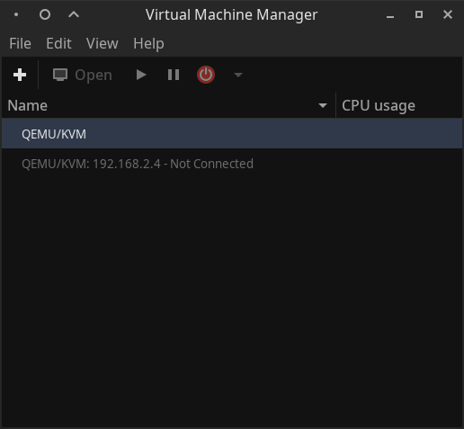
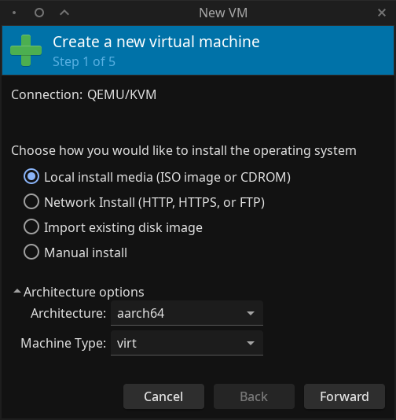
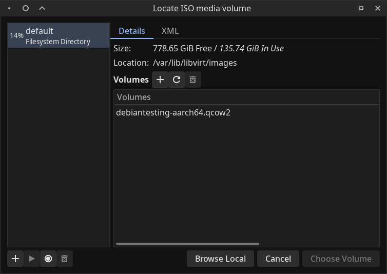
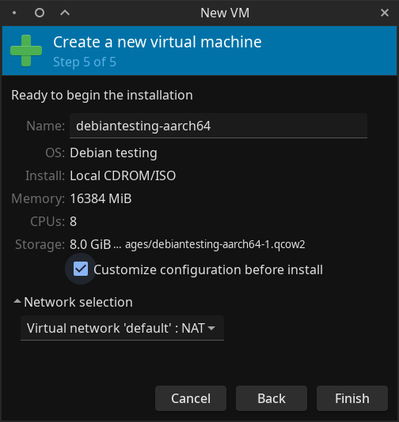
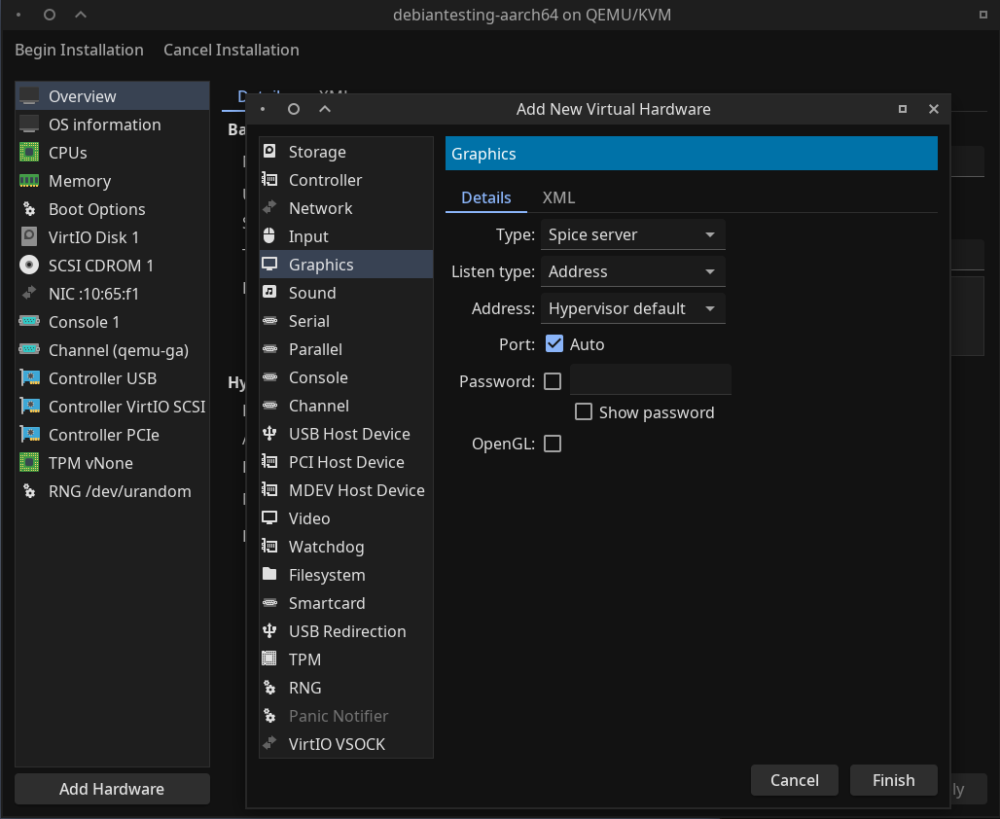
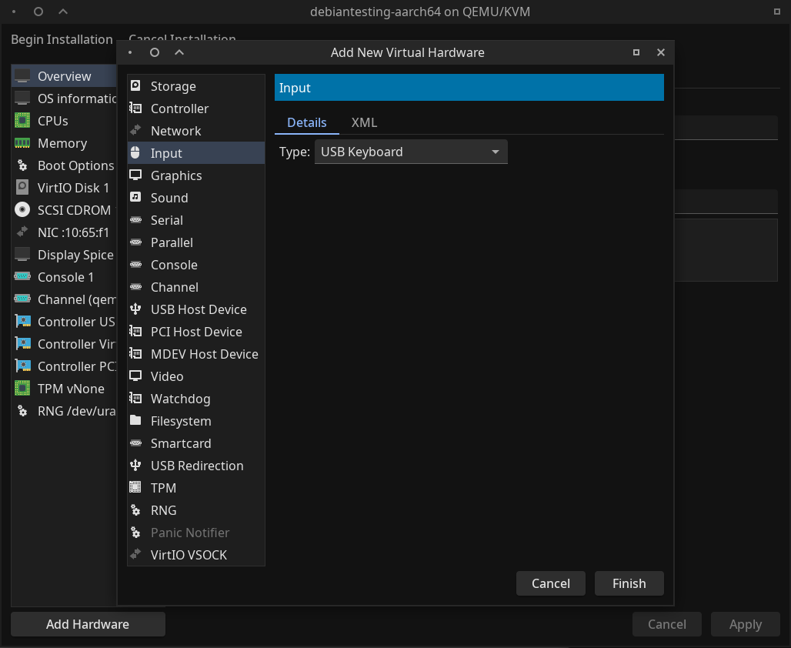

<!--
SPDX-FileCopyrightText: 2025 Eli Array Minkoff

SPDX-License-Identifier: CC-BY-SA-4.0
-->

# Install Debian Bookworm on Rock64 (eMMC)

## Prerequisites and Background

This guide is written for someone who, like me, is comfortable with Debian, and would rather not use years-old 3rd-party custom builds meant specifically for the Rock64, which may have 3rd-party software and/or configuration out-of-the-box.

I've had trouble installing Debian to my Rock64, as the installer seems to install a broken version of the u-boot bootloader - see [as365n4's forum thread](https://forum.pine64.org/showthread.php?tid=11316&pid=78384). Like as365n4, I decided to try to adapt the more general guide to [installing Devuan or Debian on ARM64 SBCs that are not officially supported](https://www.kulesz.me/post/140-debian-devuan-arm64-install/) by Daniel Kulesz.

### What you'll need

* A Rock64
* a Rock64-compatible eMMC module, with a USB adapter like [this one](https://pine64.com/product/usb-adapter-for-emmc-module/)
* An existing (ideally 64-bit) Debian desktop system, with root access
* Internet access

## Preparation

Make a folder to keep the assets related to the installation process - any commands should be run from within this folder.

Download the latest generic Debian ARM installer:

```sh
wget http://deb.debian.org/debian/dists/stable/main/installer-arm64/current/images/netboot/mini.iso
```

As root, install the `qemu-efi-aarch64`, `qemu-system-arm`, and `virt-manager` packages.

[Add your user to the `libvirt` group](../Groups-and-File-Permissions.md#adding-users-to-groups), in order to allow your user to run VMs through the system libvirt daemon. Make sure that your group membership is update by logging out and logging back in, or running `newgrp libvirt` in a terminal to start a new session `virt-manager`

### Create the virtual machine

1. launch the Virtual Machine Manager (either in an app menu, or by running the `virt-manager` command. 

2. click the `+` icon in the top corner of the menu:<br>


3. On the first page of the **New VM** window, select **Local install media (ISO image or CDROM)**, and in the **Architecture options** drop-down, select *aarch64* for the architecture. Leave the **Machine Type** set to *virt*.<br>


4. On the next page, click the **Browse...** button, and in the **Locate ISO media volume** window, click **Browse Local**, and select the `mini.iso` file you downloaded.<br/>


5. If needed, specify the operating system manually - use the best match available. Kulesz's guide recommends provisioning 1GiB of RAM and all available CPU cores, though I went with 16 GiB (16384 MiB), as I have RAM to spare. Kulesz's guide recommends at least 5 GiB of storage.

5. Extra hardware: On the final step in the "New VM" window, check **Customize configuration before install** before clicking **finish**, then add a **Video** device of type **VGA**, then add an **Input** device, choosing "USB Keyboard" in the dropdown. After that, click "Begin Installation".<br>




<!-- The mkdocs markdown renderer doesn't work well with combining Markdown and
HTML within a details block, so I've manually converted the markdown parts of the following into the HTML mkdocs would have generated for it. -->
/// details | Fixing `firewalld` issue

When I tried to provision the new VM, I hit my first snag - the libvirt default network was not running, and when I tried to start it, I saw the following error:

> `Error creating virtual network: internal error: firewalld is set to use the nftables backend, but the required firewalld 'libvirt' zone is missing. Either set the firewalld backend to 'iptables', or ensure that firewalld has a 'libvirt' zone by upgrading firewalld to a version supporting rule priorities (0.7.0+) and/or rebuilding libvirt with --with-firewalld-zone`

As pointed out in [this Debian bug report](https://bugs.debian.org/cgi-bin/bugreport.cgi?bug=1040783), Debian's libvirt package is already built with firewalld support. The solution I went with was to run the following commands (as root):

```sh
firewall-cmd --add-service=libvirt
virsh net-start --network default
firewall-cmd --reload
```
///

#### Install Debian in the VM

Once provisioned, the VM will boot into a GRUB menu. Select `Install` to launch Debian's installer.

Kulesz's guide aims to build a generic image, and recommends using simple passwords and a generic hostname and domain name. I did not do that - instead, I disabled direct root login and created an admin user called `eliminmax`.

When setting up the installation, I used the following partitions within the VM:

| Size      |  Name    | Use as                        | Mount point | Bootable flag |
|-----------|----------|-------------------------------|-------------|---------------|
| 100 M     |          | `EFI System Partition`        |             | `on`          |
| 500 M     | `boot`   | `Ext4 journaling file system` | `/boot`     | `off`         |
| remaining | `rootfs` | `Ext4 journaling file system` | `/`         | `off`         |

/// details | **Optional: Customizing the system**

You can customize the VM before proceeding, though I'd caution against anything too significant. For example, once I was able to boot into the base system, I did the following:

* Installed my custom "core-system" metapackage - an empty package which depends on utilities I always want installed, built from [this control file](https://github.com/eliminmax/debian-dependency-metapackages/blob/9311e4b98e0b6ac78dd246b237796fd911cff170/eliminmax-core-system/control)
* [Set up an ssh server](../../Utilities/Remote-Access/SSH.md), and copied my ssh public IDs to it
* installed the arm64 [Tiny Clear ELF](https://github.com/eliminmax/tiny-clear-elf) binary to /usr/local/bin/clear
* set up the `/etc/bash.bashrc` file with my ["prompt stuff"](https://gist.github.com/eliminmax/197c5f8e9fb41168b16df34ff604c5b6), and uncommented the block setting up bash completion
///

#### Preparing the Image

##### F2FS

F2FS is a filesystem optimized for flash storage, and Kulesz's guide recommends using it for the rootfs on the actual system. The following will include the needed modules in the initramfs, and install the needed tooling.

```sh
echo "f2fs" >> /etc/initramfs-tools/modules
echo "crc32" >> /etc/initramfs-tools/modules

apt install f2fs-tools
```

##### NTP

Install `systemd-timesyncd` for NTP services - this is ironic, given that the original guide this is based on is Devuan-focused, and Devuan is very anti-SystemD, but given the warning that *"the daemon fails to synchronize the clock on boot and needs to be run manually"*, I'd rather stick with it.

##### DTB File Handling

Devicetree files are needed, and must be copied over whenever the kernel is updated, so that the bootloader and kernel can run on the Rock64 hardware. As root, first create the needed directory, then add a post-install hook for kernel upgrades. The following is what Daniel Kulesz instructed in the original guide, and what I did:
<!-- SPDX-SnippetCopyrightText: 2020 Daniel Kulesz -->

```sh
# create the DTB directory
mkdir -p /boot/dtbs
# create the post-upgrade hook
cat <<'EOF' >> /etc/kernel/postinst.d/copy-dtbs
#!/bin/sh

set -e
version="$1"

echo Copying current dtb files to /boot/dtbs....
cp -a /usr/lib/linux-image-${version}/. /boot/dtbs/
EOF
# mark as executable
chmod +x /etc/kernel/postinst.d/copy-dtbs
# run for the current kernel
/etc/kernel/postinst.d/copy-dtbs `uname -r`
```

<!-- SPDX-SnippetEnd -->

##### Bootloader Configuration

Unlike the previous section, this is not copied straight from Kulesz's guide, as that's meant for Devuan with an encrypted rootfs, and I'm targeting Debian with an unencrypted rootfs

```sh
mkdir -p /boot/extlinux
cat <<'EOF' >> /boot/extlinux/extlinux.conf
TIMEOUT 2
PROMPT 1
DEFAULT debian

LABEL debian
MENU LABEL Linux debian
KERNEL /vmlinuz
INITRD /initrd.img
DEVICETREEDIR /dtbs
APPEND console=tty1 root=LABEL=rootfs rw rootwait
EOF
```

### Prepare OS to run on Rock64

***WARNING:*** **This part of the process will render the VM unbootable, even from snapshots! Before anything else, you should create a copy of the qcow2 disk image! I thought a snapshot would be enough, and had to start over as a result.**

Reboot the VM, then in a root shell, run the following to prepare to remove GRUB and prepare to boot with an f2fs rootfs:

```sh
apt autoremove --purge grub-efi-arm64 grub-common
cat <<'EOF' > /etc/fstab
# <file system>        <mount point>  <type>  <options>                   <dump>  <pass>
LABEL=rootfs       /              f2fs    noatime,background_gc=off   0       1
LABEL=boot         /boot          ext4    errors=remount-ro           0       2
EOF
poweroff
```

## Create system tarballs

Note: you have any existing partitions labeled `boot` or `rootfs` mounted on the host system before this step, it will not work as-is.

On the host system, run the following as root, to load the `nbd` kernel module to mount network block devices (changing the leading variables to appropriate values).

```sh
BUILDER_IMAGE=/var/lib/libvirt/images/builder.qcow2
NORMAL_USER=your_username
ASSET_DIR=/path/to/assets

# load kernel modules needed to mount network block devices
modprobe nbd max_part=8
# export the builder image as a network block device, at /dev/nbd0
qemu-nbd --connect=/dev/nbd0 "$BUILDER_IMAGE"
# create a directory to mount the builder image at
mkdir /mnt/builder
# mount the rootfs partition, create a tarball, and change the owner
mount /dev/disk/by-partlabel/rootfs /mnt/builder
cd /mnt/builder
tar czpf "$ASSET_DIR/rootfs.tar.gz" .
cd ..
umount builder

# mount the boot partition, create a tarball, and change the owner
mount /dev/disk/by-partlabel/boot /mnt/builder
cd builder
tar czpf "$ASSET_DIR/boot.tar.gz" .
cd ..
umount builder

# cleanup - remove the directory, and disconnect the NBD server
rmdir builder
qemu-nbd -d /dev/nbd0
```

## Build Bootloader and Firmware

### Dependencies

On the host system, install the following packages:

* `bc`
* `bison`
* `build-essential`
* `device-tree-compiler`
* `flex`
* `gcc`
* `gcc-aarch64-linux-gnu`
* `gcc-arm-none-eabi`
* `git`
* `libgnutls28-dev`
* `libssl-dev`
* `make`
* `python3-dev`
* `python3-pyelftools`
* `swig`

*feel free to copy and paste:*

```sh
apt install bc bison build-essential device-tree-compiler flex gcc gcc-aarch64-linux-gnu gcc-arm-none-eabi git libgnutls28-dev libssl-dev make python3-dev python3-pyelftools swig
```

### Trusted Firmware-A

Clone the `arm-trusted-firmware` repo:

```sh
git clone https://github.com/ARM-software/arm-trusted-firmware
cd arm-trusted-firmware
```

Find the latest stable release, and `git checkout` to its tag. At time of writing, it's v2.12.0, so I ran `git checkout v2.12.0`.

Then, compile with the following command:

```sh
make CROSS_COMPILE=aarch64-linux-gnu- PLAT=rk3328 all
```

Finally, switch back to the asset directory:

```sh
cd ..
```

### U-Boot

Clone the `u-boot` repo:

```sh
git clone git://git.denx.de/u-boot.git
cd u-boot
```

Find the latest release (at time of writing, it's v2025.01, with release candidates for v2025.04 - I'm guessing that'll release in April 2025). Check it out:

```sh
git checkout v2025.01
```

Symlink in the binary build from the Trusted Firmware-A repo, generate the build configuration, and build the bootloader

```sh
ln -s ../arm-trusted-firmware/build/rk3328/release/bl31/bl31.elf bl31.elf
make CROSS_COMPILE=aarch64-linux-gnu- BL31=bl31.elf rock64-rk3328_defconfig
make -j"$(nproc)" CROSS_COMPILE=aarch64-linux-gnu- BL31=bl31.elf all
```

## Flashing the image

***ALL COMMANDS IN THIS SECTION MUST BE RUN WITH `root` PRIVILEGES***

### Partitioning the Disk

***WARNING:*** **PARTITIONING IS A DESTRUCTIVE PROCESS! If you specify the wrong disk ID, or have data in the eMMC storage that you want to keep, this can really mess up your day! This information is provided as-is, and is intended to be helpful, but I provide NO WARRANTY as to its accuracy or safety.** *It worked on my machine without issue, but be careful, and double or triple check everything in this section!*

With that out of the way, connect the eMMC module to the desktop system, and as root, partition it:

A dry run of the partitioning process can be performed with the following:

```sh
# you may need to change the disk_id value for this to work
disk_id='/dev/disk/by-id/usb-Generic_STORAGE_DEVICE_000000000250-0:0'
sfdisk -n -W always "$disk_id" <<EOF
label: dos
,32MiB,empty,
,500MiB,linux,*
,1GiB,swap,
,,linux,
EOF
```

* `-n` prevents it from actually overwriting the existing partition table.
* `-W always` will always wipe existing file system signatures that are found during partitioning, to avoid any conflicts.

* `label: dos`: use the `MS-DOS` partition layout
* `,32MiB,empty,`: create an empty reserved 32MiB partition, to make sure that there's room to install the bootloader
* `,500MiB,linux,*`: create a 500MiB partition for use with a Linux filesystem, and mark it as bootable
* `,1GiB,swap,`: create a 1GiB partition for use as Linux swap space.
* `,,linux,`: create a partition for use with a Linux filesystem, using all available remaining space

If you are sure that it's not going to mess anything up, you can re-run the command without the `-n` flag.

### Setting up the file systems

If needed, install f2fstools:

```sh
apt install f2fs-tools
```

Format the file systems:

```sh
# you may need to change the disk_id value for this to work
disk_id='/dev/disk/by-id/usb-Generic_STORAGE_DEVICE_000000000250-0:0'
mkfs.ext4 -L boot "${disk_id}-part2"
mkswap -L swap "${disk_id}-part3"
mkfs.f2fs -l rootfs "${disk_id}-part4"
```

### Unpacking the filesystem contents

Mount the `boot` partition and unpack the `boot` tarball to it, then repeat for the `rootfs` partition, and update the `fstab` to include swap and use `UUID` instead of `LABEL`:

```sh
# set ASSET_DIR to the proper path
ASSET_DIR=/path/to/assets
mkdir /mnt/rock64
mount /dev/disk/by-label/rootfs /mnt/rock64
cd /mnt/rock64
tar xzvpf "$ASSET_DIR/rootfs.tar.gz"
cd boot
tar xzvpf "$ASSET_DIR/boot.tar.gz"

cd "$ASSET_DIR"
```

### Unmounting the filesystem and flashing the bootloader

***WARNING:*** **Specifying the wrong disk in this step can destroy your data, and getting the parameters to `dd` wrong can damage your partition layout or overwrite the system!**

```sh
umount /mnt/rock64/boot
umount /mnt/rock64
```

```sh
# set ASSET_DIR to the proper path
ASSET_DIR=/path/to/assets
# you may need to change the disk_id value for this to work
disk_id='/dev/disk/by-id/usb-Generic_STORAGE_DEVICE_000000000250-0:0'

dd if="$ASSET_DIR/idbloader.img" of="$disk_id" seek=64 conv=notrunc
dd if="$ASSET_DIR/u-boot.itb" of="$disk_id" seek=16384 conv=notrunc
```

## Post-installation

### (Required) Fix networking

The interface name on the VM won't match the interface name on the rock64, so it needs to be replaced in `/etc/network/interfaces`. In my case, the VM interface was `enp1s0`, and the bare-metal system was `end0`, so I had to change the last 2 lines of that file from

```
allow-hotplug enp1s0
iface enp1s0 inet dhcp
```

to 

```
allow-hotplug end0
iface end0 inet dhcp
```

to get networking working.

### (Recommended) Update `fstab` to use `UUID`s instead of `LABEL`s, and enable use of swap

Run the following (as root):

```sh
# NOTE: this will all be well-aligned once the command substitution takes effect
cat >/mnt/rock64/etc/fstab <<EOF
# <file system>                     <mount point>  <type>  <options>                   <dump>  <pass>
$(blkid -t LABEL=rootfs --output export | grep ^UUID=)   /       f2fs    noatime,background_gc=off   0       1
$(blkid -t LABEL=boot --output export | grep ^UUID=)   /boot   ext4    errors=remount-ro           0       2
$(blkid -t LABEL=swap --output export | grep ^UUID=)   swap    swap    default                     0       0
EOF
systemctl daemon-reload
```

### (**Highly** Recommended) Remove SSH host keys and Machine ID

The machine ID and SSH host keys were originally from the VM, and should be replaced.

1. Remove the SSH Keys by running `#!sh rm -f /etc/ssh/ssh_host_*_key*`

2. Regenerate the SSH keys by running `#!sh dpkg-reconfigure openssh-server`

3. Remove the old machine ID by running `#!sh rm -f /etc/machine-id /var/lib/dbus/machine-id`

4. Reboot the server. New `machine-id` files will be regenerated.
