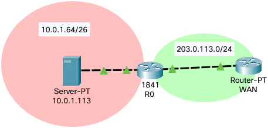

<!--
SPDX-FileCopyrightText: 2021 - 2024 Eli Array Minkoff

SPDX-License-Identifier: CC-BY-SA-4.0
-->

# Cisco IOS

Cisco had the name first. It's the family of operating systems running on their routers and switches.

<!-- vim-markdown-toc GitLab -->

* [Gain privileged access](#gain-privileged-access)
* [Enter configuration mode](#enter-configuration-mode)
* [Create VLAN](#create-vlan)
* [Edit a range of interfaces](#edit-a-range-of-interfaces)
* [Configure an access port](#configure-an-access-port)
* [Configure a trunk port](#configure-a-trunk-port)
* [Enable Routing on a Multi Layer Switch](#enable-routing-on-a-multi-layer-switch)
* [Enable and Configure OSPF](#enable-and-configure-ospf)
* [Static NAT](#static-nat)
* [Port Address Translation](#port-address-translation)
* [BGP](#bgp)
  * [Set up communication](#set-up-communication)
    * [ON 1234](#on-1234)
    * [ON 1111](#on-1111)
  * [Advertise a network](#advertise-a-network)

<!-- vim-markdown-toc -->

NOTE: All listed commands begin with a prompt. The prompt is not actually part of the command, and should not be typed out. All prompts end with `#` or `>`. The former indicates privileged access. In more specific modes, the mode will be listed between the device name and the prompt end (e.g. `SW0(config)#`)

### Gain privileged access
```cisco
SW0>enable
SW0#
```

### Enter configuration mode
```cisco
SW0#configure terminal
SW0(config)#
```

### Create VLAN
For a VLAN #100 with the name `VLANNAME100`, run the following:
```cisco
SW0(config)#vlan 100
SW0(config-vlan)#name VLANNAME100
SW0(config-vlan)#exit
```

### Edit a range of interfaces
To run the same commands for FastEthernet 0/2, FastEthernet 0/3, and FastEthernet 0/4, run the following:
```cisco
SW0(config)#interface range FastEthernet 0/2-4
SW0(config-if-range)#
```

### Configure an access port
To set FastEthernet 0/4 to use VLAN 120, run the following:
```cisco
SW0(config)#interface FastEthernet 0/4
SW0(config-if)#switchport access vlan 120
```

### Configure a trunk port
To set up FastEthernet 0/1 as a trunk port, run the following:
```cisco
SW0(config)#interface FastEthernet 0/1
SW0(config-if)#switchport mode trunk
```

### Enable Routing on a Multi Layer Switch
```cisco
SW0(config)#ip routing
```

### Enable and Configure OSPF
OSPF requires each router to advertise connected networks to other routers. You can get a router `R0` to advertise the networks `192.168.0.0/23`, `192.168.2.0/24`, and `192.168.3.0/24` to OSPF area 0 with proccess #1 with the following:

```cisco
R0(config)#router ospf 1
R0(config-router)#network 192.168.0.0 0.0.1.255 area 0
R0(config-router)#network 192.168.2.0 0.0.0.255 area 0
R0(config-router)#network 192.168.3.0 0.0.0.255 area 0
```

### Static NAT


To set up a router `R0` to make the server `10.0.1.113` publicly accessible as `203.0.113.102`, do the following:
```cisco
R0(config)#interface FastEthernet 0/0
R0(config-if)#ip address 20.0.113.101 255.255.255.0
R0(config-if)#no shutdown
R0(config-if)#ip nat outside
R0(config-if)#exit
R0(config)#
R0(config)#interface FastEthernet 0/1
R0(config-if)#ip address 10.0.1.65 255.255.255.192
R0(config-if)#no shutdown
R0(config-if)#ip nat inside
R0(config-if)#exit
R0(config)#
R0(config)#ip nat inside source static 10.0.1.113 203.0.113.102
```

### Port Address Translation
*Setup is similar to [above](#static-nat)*

To configure PAT for addresses in the network `192.168.0.0/16` (connected to `GigabitEthernet 0/0`) to public addresses `198.51.100.10` through `192.51.100.15` (via `GigabitEthernet 0/1`), do the following:
```cisco
R0(config)#interface GigabitEthernet 0/0
R0(config-if)#ip nat inside
R0(config-if)#exit
R0(config)#interface GigabitEthernet 0/1
R0(config-if)#ip nat inside
R0(config-if)#exit
R0(config)#ip nat pool users 198.51.100.10 198.51.100.15 netmask 255.255.255.0
R0(config)#access-list 1 permit 192.168.0.0 0.0.255.255
R0(config)#ip nat inside source list 1 pool users overload
```

### BGP

#### Set up communication

To establish a router on Autonomous System 1234 with the IP address `198.51.100.22` and a rounter on Autonomous System 1111 with the IP address `198.51.100.23` as neigbors, run the following:

##### ON 1234
```cisco
R1234(config)#router bgp 1234
R1234(config-router)#neighbor 198.51.100.23 remote-as 1111
```

##### ON 1111
```cisco
R1111(config)#router bgp 1111
R1111(config-router)#neighbor 198.51.100.22 remote-as 1234
```

#### Advertise a network

To get `R1111` to advertise the 192.0.2.0/24 network to its neighbors, run the following:
```cisco
R111(config-router)#network 192.0.2.0 mask 255.255.255.0
```
It will then share this network with any mutually-established neighbors, and pass along other BGP routes from neighbor to neighbor.
