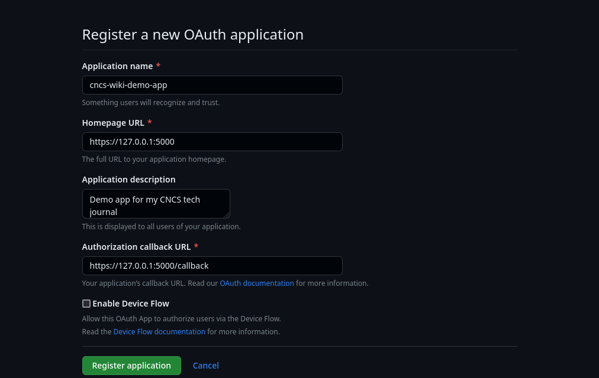

<!--
SPDX-FileCopyrightText: 2023 Eli Array Minkoff

SPDX-License-Identifier: MIT
-->

# OAuth

{{ j2_template_note }}

OAuth (Open Authorization) is the protocol that underpins "login with Google/Facebook/Github/etc." options you often see when signing into websites.

For a class lab, I made a few slight modifications to the "[real example](https://requests-oauthlib.readthedocs.io/en/latest/examples/real_world_example.html#real-example)" provided by the official docs for the Python Requests-OAuthlib.

You can test if the dependencies are installed by running the command `python3 -c 'import flask, flask.json, requests_oauthlib;print("success")'` in a Bourne-like command-line shell (e.g. `sh`, `bash`, or `zsh`)

If it prints a `ModuleNotFound` error, you do not have them all installed.

If it prints a `python3: command not found` message (or your shell's equivalent), you don't have python installed.

If it prints `success`, then you have them all installed

On Debian 11.6 Bullseye (the stable release at time of writing), you can install the dependencies by running the following as root (or with `sudo`):

```sh
apt install python3-flask python3-requests-oauthlib
```

Once you've done that, you can download my modified version.

Create a working directory and download my script.

```sh
mkdir oauthapp
cd oauthapp
wget https://raw.githubusercontent.com/eliminmax/cncs-journal/master/SEC440/oauthlab/webapp.py
```

Now, log into Github, and open https://github.com/settings/applications/new in a browser.

Fill in the fields, setting the homepage URL to `https://127.0.0.1:5000` and the authorization callback URL to `https://127.0.0.1:5000/callback`. Once you click the `Register application` button, then generate a Client secret.



In the `oauthapp` directory, create a JSON file called `creds.json` with the following structure:

```json
{
    "client_id": "{{ client_id }}",
    "client_secret": "{{ client_secret }}",
    "authorization_base_url": "https://github.com/login/oauth/authorize",
    "token_url": "https://github.com/login/oauth/access_token"
}
```

After that, run the Python script, and navigate to `https://127.0.0.1:5000` in a web browser. Allow the Github app, and you should see JSON-formatted data about your Github account.

Once complete, you can go to the `Advanced` tab in the sidebar for the OAuth app, and delete the application, unless you want to keep it around for some reason.
